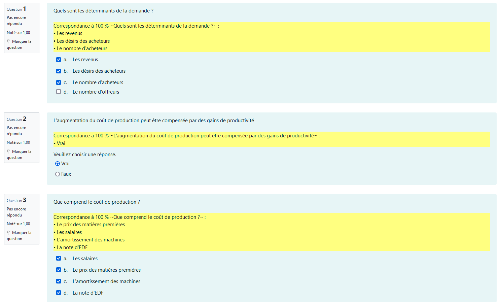

# ECONOMeasY

## I. Description :
This is a firefox addon allowing during Moodle quizzes *(knowing the questions present in the question bank)* to display the answers directly on the test

**DISCLAIMER** : This does not replace the real knowledge that should normally be acquired but allows you to maximize your mark *(if you ever notice as it was the case for us, that the questions during the optional tests were drawn from the same database as that of the marked tests)*, I would not be responsible for your lack of knowledge on the module.

## II. Demo :
**What appears in yellow is added by the script**, you can then choose the correct answer

## III. How to install :

- Enter **about:debugging** in the URL bar.
- In the left-hand menu, click **This Firefox** *(or This Nightly)*.
- Click the **Load Temporary Add-on button**, then select any file in ./src directory.

*If you want to test this extension in private browsing open **about:addons**, click on the extension, and select the Allow radio button for Run in Private Windows.*

## IV. How to uninstall :

- Enter **about:addons** in the URL bar.
- Uninstall

*code is ugly*